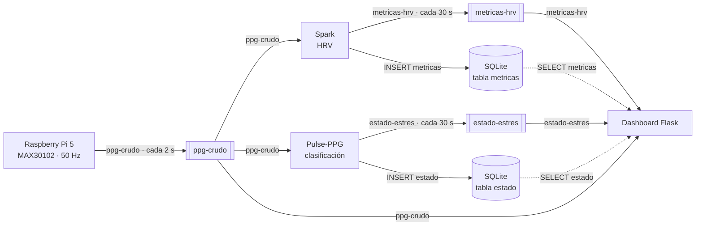

# Contratos de Datos — PPG-StressPi

## 1. Introducción

Este documento define el formato de los datos que intercambian los componentes de PPG-StressPi: los mensajes de los 3 topics de Kafka y las 2 tablas SQLite. Es la referencia oficial para implementar productores, consumidores y consultas.

- **Versión del contrato:** `v1.0`
- **Alcance:** Raspberry Pi 5 (productor), Spark, Pulse-PPG y Dashboard Flask.
- **Principio:** el contrato manda sobre la implementación. Si un contrato cambia, todos los componentes que lo producen o consumen deben actualizarse en el mismo ciclo. Nunca se despliega un productor con un contrato que sus consumidores aún no soportan.

## 2. Convenciones generales

| Aspecto | Regla |
|---|---|
| Formato | JSON, codificación UTF-8, un objeto por mensaje Kafka |
| Timestamps | ISO 8601 con milisegundos y sufijo `Z`: `2026-09-24T19:32:15.234Z` |
| Zona horaria | **UTC** en todos los mensajes y en SQLite. La conversión a hora local (America/Mexico_City) se hace solo en el Dashboard |
| Nombres de campos | `snake_case`, en español, sin acentos |
| Unidades | En el sufijo del nombre cuando aplica: `_ms`, `_hz`, `_s`, `bpm` |
| Números | `int` = entero JSON sin decimales; `float` = número JSON, redondeado a 2 decimales salvo indicación |
| Obligatoriedad | Campo **obligatorio**: debe existir y no ser `null`. Campo **opcional**: puede omitirse o ser `null` |
| Campos extra | Los consumidores deben **ignorar** campos desconocidos (compatibilidad hacia adelante) |
| Clave Kafka | `sesion_id` como *key* del mensaje, para conservar el orden dentro de la partición |
| Versión | Todo mensaje incluye `version_contrato` (`"1.0"`) |
| Sesión | `sesion_id` = `S` + fecha/hora UTC de inicio, `SYYYYMMDD-HHMMSS` (ej: `S20260924-193000`) |

## 3. Contrato 1: topic `ppg-crudo`

- **Descripción:** lote de señal PPG cruda del sensor MAX30102.
- **Productor:** Raspberry Pi 5 · **Consumidores:** Spark, Pulse-PPG, Dashboard · **Frecuencia:** 1 mensaje cada 2 s (100 muestras a 50 Hz)

| Campo | Tipo | Unidad | Obligatorio | Descripción |
|---|---|---|---|---|
| `version_contrato` | string | — | Sí | Versión del contrato, `"1.0"` |
| `dispositivo_id` | string | — | Sí | Identificador de la Pi, ej. `"pi5-01"` |
| `sesion_id` | string | — | Sí | Sesión de medición (ver §2) |
| `seq` | int | — | Sí | Contador del lote dentro de la sesión, empieza en 0 y sube de 1 en 1 |
| `ts_inicio` | string | ISO 8601 UTC | Sí | Primera muestra del lote; la muestra `i` ocurre en `ts_inicio + i × 20 ms` |
| `fs_hz` | int | Hz | Sí | Frecuencia de muestreo, fija en `50` |
| `n_muestras` | int | — | Sí | Muestras del lote, fija en `100` |
| `ir_raw` | array[int] | cuentas ADC | Sí | Canal infrarrojo, longitud = `n_muestras` |
| `red_raw` | array[int] | cuentas ADC | No | Canal rojo, misma longitud que `ir_raw` si está presente |
| `dedo_detectado` | bool | — | Sí | `false` si la media de IR < 50 000 (sin contacto) |

**Ejemplo completo:**

```json
{
  "version_contrato": "1.0",
  "dispositivo_id": "pi5-01",
  "sesion_id": "S20260924-193000",
  "seq": 157,
  "ts_inicio": "2026-09-24T19:35:14.000Z",
  "fs_hz": 50,
  "n_muestras": 100,
  "dedo_detectado": true,
  "ir_raw": [
    112360, 112323, 112182, 111974, 111689, 111451, 111348, 111382, 111610, 111870, 112119, 112275, 112304, 112378, 112337, 112277, 112148, 112076, 112050, 112052,
    112105, 112163, 112258, 112305, 112389, 112431, 112429, 112502, 112481, 112501, 112459, 112458, 112471, 112479, 112500, 112493, 112478, 112468, 112481, 112528,
    112479, 112508, 112468, 112345, 112234, 112033, 111674, 111489, 111417, 111512, 111792, 112056, 112241, 112429, 112476, 112478, 112447, 112354, 112272, 112172,
    112184, 112159, 112210, 112263, 112352, 112434, 112533, 112484, 112519, 112572, 112609, 112591, 112532, 112519, 112593, 112569, 112562, 112616, 112622, 112601,
    112606, 112613, 112644, 112622, 112556, 112460, 112229, 112046, 111766, 111568, 111492, 111693, 111999, 112199, 112431, 112563, 112534, 112588, 112509, 112420
  ]
}
```

**Validaciones:**

- `len(ir_raw) == n_muestras == 100`; si hay `red_raw`, misma longitud.
- Cada valor en `0 … 262143` (ADC de 18 bits del MAX30102). Con dedo colocado, IR suele estar entre 50 000 y 200 000.
- `seq` crece de 1 en 1; un salto indica lotes perdidos y el consumidor lo registra en el log sin detenerse.
- `fs_hz == 50`; cualquier otro valor se rechaza.
- Tamaño máximo del mensaje: **4 KB** (el típico ronda 1 KB solo con IR y 2 KB con IR + rojo).
- Si `dedo_detectado == false`, Spark y Pulse-PPG descartan el lote para el cálculo; el Dashboard lo muestra como "sin contacto".

## 4. Contrato 2: topic `metricas-hrv`

- **Descripción:** métricas de variabilidad de frecuencia cardiaca de una ventana de 30 s.
- **Productor:** Spark · **Consumidor:** Dashboard · **Frecuencia:** 1 mensaje cada 30 s (ventana de 15 lotes de `ppg-crudo`, sin solapamiento)

| Campo | Tipo | Unidad | Obligatorio | Descripción |
|---|---|---|---|---|
| `version_contrato` | string | — | Sí | `"1.0"` |
| `sesion_id` | string | — | Sí | Sesión de origen |
| `ts_ventana_inicio` | string | ISO 8601 UTC | Sí | Inicio de la ventana analizada |
| `ts_ventana_fin` | string | ISO 8601 UTC | Sí | Fin de la ventana; **clave de unión** con `estado-estres` |
| `ventana_s` | int | s | Sí | Duración de la ventana, `30` |
| `bpm` | float | latidos/min | Sí | Frecuencia cardiaca media |
| `sdnn_ms` | float | ms | Sí | Desviación estándar de los intervalos NN |
| `rmssd_ms` | float | ms | Sí | Raíz cuadrática media de diferencias sucesivas NN |
| `n_latidos` | int | — | Sí | Latidos válidos detectados en la ventana |
| `calidad_senal` | float | 0–1 | No | Fracción de lotes válidos (`dedo_detectado`) en la ventana |

**Ejemplo completo:**

```json
{
  "version_contrato": "1.0",
  "sesion_id": "S20260924-193000",
  "ts_ventana_inicio": "2026-09-24T19:35:00.000Z",
  "ts_ventana_fin": "2026-09-24T19:35:30.000Z",
  "ventana_s": 30,
  "bpm": 74.2,
  "sdnn_ms": 48.6,
  "rmssd_ms": 36.1,
  "n_latidos": 37,
  "calidad_senal": 1.0
}
```

**Validaciones:**

- `30 ≤ bpm ≤ 200`
- `0 ≤ sdnn_ms ≤ 300` y `0 ≤ rmssd_ms ≤ 300`
- `n_latidos ≥ 10`; con menos, Spark **no publica** la ventana (señal insuficiente).
- `ts_ventana_fin − ts_ventana_inicio == ventana_s`
- Las ventanas se alinean a múltiplos de 30 s desde el inicio de la sesión, igual que en Pulse-PPG.

## 5. Contrato 3: topic `estado-estres`

- **Descripción:** clasificación del estado del sujeto por Pulse-PPG (embeddings de 512 dimensiones + clasificador).
- **Productor:** Pulse-PPG · **Consumidor:** Dashboard · **Frecuencia:** 1 mensaje cada 30 s (coincide con la ventana de análisis)

| Campo | Tipo | Unidad | Obligatorio | Descripción |
|---|---|---|---|---|
| `version_contrato` | string | — | Sí | `"1.0"` |
| `sesion_id` | string | — | Sí | Sesión de origen |
| `ts_ventana_inicio` | string | ISO 8601 UTC | Sí | Inicio de la ventana |
| `ts_ventana_fin` | string | ISO 8601 UTC | Sí | Fin de la ventana; clave de unión con `metricas-hrv` |
| `estado` | string (enum) | — | Sí | `"relajado"`, `"neutro"` o `"estresado"` |
| `confianza` | float | 0–1 | Sí | Probabilidad de la clase elegida (3 decimales) |
| `probabilidades` | object | 0–1 | No | Probabilidad por clase, con las 3 claves de `estado` |
| `modelo_version` | string | — | Sí | Versión del modelo/clasificador, ej. `"pulse-ppg-1.0+clf-0.3"` |

**Ejemplo completo:**

```json
{
  "version_contrato": "1.0",
  "sesion_id": "S20260924-193000",
  "ts_ventana_inicio": "2026-09-24T19:35:00.000Z",
  "ts_ventana_fin": "2026-09-24T19:35:30.000Z",
  "estado": "estresado",
  "confianza": 0.812,
  "probabilidades": {"relajado": 0.041, "neutro": 0.147, "estresado": 0.812},
  "modelo_version": "pulse-ppg-1.0+clf-0.3"
}
```

**Validaciones:**

- `estado ∈ {"relajado", "neutro", "estresado"}` (minúsculas, sin acentos).
- `0.0 ≤ confianza ≤ 1.0`
- Si hay `probabilidades`: las 3 claves presentes, suma = 1.0 ± 0.01, y `confianza == probabilidades[estado]`.

## 6. Tablas SQLite

Base de datos: `./data/ppg.db`, volumen Docker compartido. Se abre en modo **WAL** (`PRAGMA journal_mode=WAL;`) para permitir que Spark y Pulse-PPG escriban mientras el Dashboard lee. Cada tabla tiene **un solo escritor**. El Dashboard une ambas con `metricas JOIN estado USING (sesion_id, ts_ventana_fin)`.

### 6.1 Tabla `metricas`

- **Escribe:** Spark · **Lee:** Dashboard

| Columna | Tipo SQL | Descripción |
|---|---|---|
| `id` | INTEGER PRIMARY KEY AUTOINCREMENT | Identificador interno |
| `sesion_id` | TEXT NOT NULL | Sesión |
| `ts_ventana_inicio` | TEXT NOT NULL | ISO 8601 UTC |
| `ts_ventana_fin` | TEXT NOT NULL | ISO 8601 UTC |
| `bpm` | REAL NOT NULL | Latidos/min |
| `sdnn_ms` | REAL NOT NULL | ms |
| `rmssd_ms` | REAL NOT NULL | ms |
| `n_latidos` | INTEGER NOT NULL | Latidos válidos |
| `calidad_senal` | REAL | 0–1, puede ser NULL |
| `creado_en` | TEXT NOT NULL DEFAULT (strftime('%Y-%m-%dT%H:%M:%fZ','now')) | Momento de inserción |

Índices: `UNIQUE (sesion_id, ts_ventana_fin)` (evita duplicados si Spark reprocesa).

Ejemplo de fila: `(42, 'S20260924-193000', '2026-09-24T19:35:00.000Z', '2026-09-24T19:35:30.000Z', 74.2, 48.6, 36.1, 37, 1.0, '2026-09-24T19:35:31.408Z')`

### 6.2 Tabla `estado`

- **Escribe:** Pulse-PPG · **Lee:** Dashboard

| Columna | Tipo SQL | Descripción |
|---|---|---|
| `id` | INTEGER PRIMARY KEY AUTOINCREMENT | Identificador interno |
| `sesion_id` | TEXT NOT NULL | Sesión |
| `ts_ventana_inicio` | TEXT NOT NULL | ISO 8601 UTC |
| `ts_ventana_fin` | TEXT NOT NULL | ISO 8601 UTC |
| `estado` | TEXT NOT NULL CHECK (estado IN ('relajado','neutro','estresado')) | Clase |
| `confianza` | REAL NOT NULL CHECK (confianza BETWEEN 0 AND 1) | Probabilidad de la clase |
| `prob_relajado` | REAL | Opcional |
| `prob_neutro` | REAL | Opcional |
| `prob_estresado` | REAL | Opcional |
| `modelo_version` | TEXT NOT NULL | Versión del modelo |
| `creado_en` | TEXT NOT NULL DEFAULT (strftime('%Y-%m-%dT%H:%M:%fZ','now')) | Momento de inserción |

Índices: `UNIQUE (sesion_id, ts_ventana_fin)`; `INDEX (sesion_id, estado)` para el resumen de sesión.

Ejemplo de fila: `(42, 'S20260924-193000', '2026-09-24T19:35:00.000Z', '2026-09-24T19:35:30.000Z', 'estresado', 0.812, 0.041, 0.147, 0.812, 'pulse-ppg-1.0+clf-0.3', '2026-09-24T19:35:32.117Z')`

## 7. Diagrama de flujo de datos



## 8. Versionado del contrato

- El documento vive en `docs/contratos.md` dentro del repositorio; se modifica solo mediante *pull request* revisado por quien mantiene cada componente afectado.
- Versionado `MAYOR.MENOR`:
  - **MENOR** (1.0 → 1.1): se agrega un campo opcional. Los consumidores antiguos siguen funcionando porque ignoran campos desconocidos.
  - **MAYOR** (1.x → 2.0): se renombra, elimina o cambia el tipo de un campo, o un opcional pasa a obligatorio.
- **Regla:** cualquier cambio en un contrato exige actualizar en el mismo PR el productor, todos sus consumidores y los esquemas de validación (§9). Para `ppg-crudo` eso significa los 3 consumidores; para `metricas-hrv` y `estado-estres`, productor + Dashboard + tabla SQLite.
- `version_contrato` se actualiza en todos los mensajes al publicar la nueva versión.

| Versión | Fecha | Cambio | Autor |
|---|---|---|---|
| 1.0 | 2026-09-24 | Versión inicial: 3 topics y 2 tablas SQLite | Chema |

## 9. Ejemplos de validación en Python

Requiere `pip install jsonschema`. Cada consumidor valida al recibir el mensaje; si falla, lo registra en el log y lo descarta sin detenerse.

```python
from jsonschema import validate, ValidationError

TS = {"type": "string", "pattern": r"^\d{4}-\d{2}-\d{2}T\d{2}:\d{2}:\d{2}\.\d{3}Z$"}
MUESTRAS = {"type": "array", "minItems": 100, "maxItems": 100,
            "items": {"type": "integer", "minimum": 0, "maximum": 262143}}
ESTADOS = ["relajado", "neutro", "estresado"]
BASE = ["version_contrato", "sesion_id"]
VENTANA = {"version_contrato": {"const": "1.0"}, "ts_ventana_inicio": TS, "ts_ventana_fin": TS}

ESQUEMA_PPG_CRUDO = {"type": "object",
    "required": BASE + ["dispositivo_id", "seq", "ts_inicio", "fs_hz", "n_muestras",
                        "ir_raw", "dedo_detectado"],
    "properties": {"version_contrato": {"const": "1.0"}, "seq": {"type": "integer", "minimum": 0},
        "ts_inicio": TS, "fs_hz": {"const": 50}, "n_muestras": {"const": 100},
        "ir_raw": MUESTRAS, "red_raw": {"anyOf": [MUESTRAS, {"type": "null"}]},
        "dedo_detectado": {"type": "boolean"}}}

ESQUEMA_METRICAS_HRV = {"type": "object",
    "required": BASE + ["ts_ventana_inicio", "ts_ventana_fin", "ventana_s", "bpm",
                        "sdnn_ms", "rmssd_ms", "n_latidos"],
    "properties": {**VENTANA, "ventana_s": {"const": 30},
        "bpm": {"type": "number", "minimum": 30, "maximum": 200},
        "sdnn_ms": {"type": "number", "minimum": 0, "maximum": 300},
        "rmssd_ms": {"type": "number", "minimum": 0, "maximum": 300},
        "n_latidos": {"type": "integer", "minimum": 10},
        "calidad_senal": {"type": ["number", "null"], "minimum": 0, "maximum": 1}}}

ESQUEMA_ESTADO_ESTRES = {"type": "object",
    "required": BASE + ["ts_ventana_inicio", "ts_ventana_fin", "estado", "confianza",
                        "modelo_version"],
    "properties": {**VENTANA, "estado": {"enum": ESTADOS},
        "confianza": {"type": "number", "minimum": 0.0, "maximum": 1.0},
        "probabilidades": {"type": "object", "required": ESTADOS, "additionalProperties": False,
            "properties": {e: {"type": "number", "minimum": 0, "maximum": 1} for e in ESTADOS}}}}

def validar_ppg_crudo(msg: dict) -> None:
    validate(msg, ESQUEMA_PPG_CRUDO)
    if msg.get("red_raw") and len(msg["red_raw"]) != len(msg["ir_raw"]):
        raise ValidationError("red_raw e ir_raw con longitudes distintas")

def validar_metricas_hrv(msg: dict) -> None:
    validate(msg, ESQUEMA_METRICAS_HRV)

def validar_estado_estres(msg: dict) -> None:
    validate(msg, ESQUEMA_ESTADO_ESTRES)
    p = msg.get("probabilidades")
    if p:  # reglas que JSON Schema no expresa
        if abs(sum(p.values()) - 1.0) > 0.01:
            raise ValidationError("probabilidades no suman 1.0")
        if abs(p[msg["estado"]] - msg["confianza"]) > 1e-3:
            raise ValidationError("confianza != probabilidades[estado]")
```
